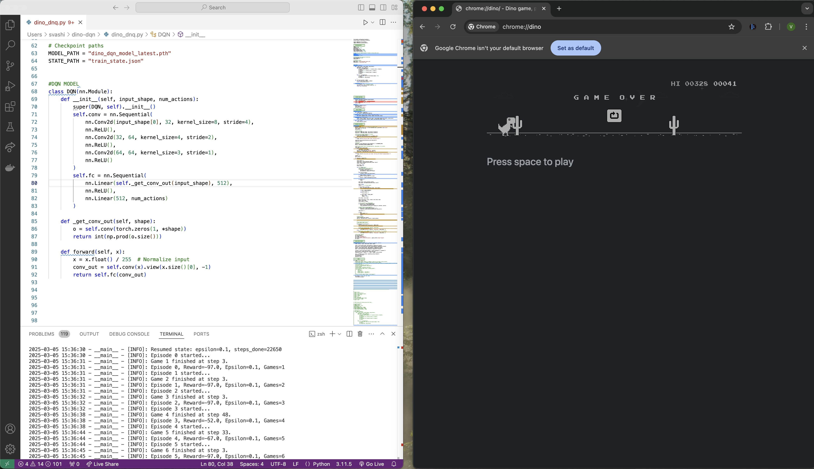

# Dino DQN Project

This project uses Deep Q-Learning to train an AI to play the Chrome Dino game.

## Setup and Running

1. Install the required dependencies:
   ```
   pip install -r requirements.txt
   ```

2. Run the Chrome Dino game in your browser by navigating to `chrome://dino`

3. Run the training script:
   ```
   python3 dino_dnq.py
   ```

## Preview




## Files

- `dino_dnq.py`: The main script that runs the DQN training
- `dino_dqn_model_latest.pth`: The latest trained model
- `train_state.json`: The current training state (epsilon, steps done)
- `debug.log`: Detailed logs of the training process

## Customization

If you need to adjust the screen capture region, modify the `env_region` variable in `dino_dnq.py`:

```python
env_region = (left, top, width, height)
```

## Troubleshooting

If you encounter issues:

1. Make sure the Chrome Dino game is visible on your screen
2. Check that the screen capture region is correctly set
3. Ensure all dependencies are installed correctly
